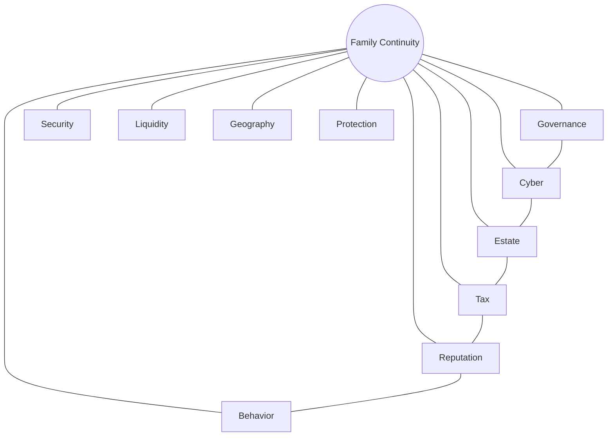

# AKILI Risk Intelligence — Investor Deck

**Category:** Governance Intelligence Platform for affluent families and the professional firms that serve them

**Entity:** AKILI Risk Intelligence · [akilirisk.com](https://akilirisk.com) · hello@akilirisk.com

> **Deck type:** Fundraising narrative. For product walkthroughs and feature depth, see [pitch-deck-product.md](./pitch-deck-product.md).

---

## Slide 1 — Title

**AKILI Risk Intelligence**

*The governance intelligence platform for modern family wealth.*

---

## Slide 2 — The Problem

**Every professional protects a piece of the family. Nobody owns the whole picture.**

Families spend millions on wealth management, tax planning, estate counsel, succession planning, and cybersecurity — but almost nothing **measuring** whether the family itself is governable over time.

---

## Slide 3 — The Story *(emotional anchor)*

Imagine a wealthy family. **$40M net worth.** Everything appears perfect.

Then Dad dies unexpectedly.

- No one knows who has signing authority
- The password manager is inaccessible
- The successor trustee doesn't know they're the trustee
- The family business stalls
- Children disagree over distributions
- The wealth advisor, CPA, and estate attorney each had a fragment — **none had the whole picture**

**Nothing failed financially. Everything failed operationally.**

That's the problem AKILI solves.

---

## Slide 4 — Why Now?

| Force | Why it matters |
|-------|----------------|
| **Largest intergenerational wealth transfer in history** | Trillions moving to heirs who are unprepared to govern |
| **Rising cybercrime targeting affluent families** | HNW households are high-value, soft targets |
| **AI-driven fraud and impersonation** | Deepfakes and social engineering scale faster than human vigilance |
| **Professional commoditization** | Firms need differentiated, high-trust planning beyond siloed expertise |
| **Estate complexity increasing** | Trusts, entities, digital assets, multi-jurisdiction families |
| **Family offices growing rapidly** | More households need institutional-grade governance — without building it in-house |

The window is open for a **new category** between fragmented professional advice and family continuity.

---

## Slide 5 — The Solution

**Traditional assessments generate reports. AKILI creates a living system of record for family governance.**

AKILI gives **professional firms and families** a **living system** for family risk — one that:

| | |
|---|---|
| **Remembers** | Household structure, roles, history, and prior assessments |
| **Measures** | Posture across 10 risk domains with transparent scoring |
| **Tracks** | Change over time — not a one-time PDF in a drawer |
| **Compares** | Portfolio-wide patterns across a firm's client book |
| **Connects** | Professionals, families, and deliverables in one secure workflow |
| **Creates continuity** | From discovery through action — and ongoing monitoring |

**Family Risk Intelligence™** — structured, measurable, **professional-led**.

We sell **confidence**, not questionnaires.

---

## Slide 6 — Product *(demo slide — visual-first)*

**Show, don't tell.** Four screenshots, minimal copy:

| | |
|---|---|
| **Heat map** | 10-pillar Family Governance Score across the household |
| **Firm pipeline** | Multi-client status from intake through deliverables |
| **Risk profile** | Missing controls, emphasis areas, trend over time |
| **Branded report** | Client-ready PDF under firm white-label |

*Drop live screenshots from `preview.akilirisk.com` before the meeting.*

---

## Slide 7 — Everything Is Connected *(iconic slide)*

**Title:** Everything is connected.

**Subtitle:** Traditional planning treats these risks independently. AKILI understands how they interact.

**Center:** Family Continuity

**Ring:** Governance · Cyber · Estate · Tax · Reputation · Behavior · Security · Liquidity · Geography · Protection

**Design note:** One unforgettable visual — center hub, domain ring, cross-connections between domains. No table.

---

## Slide 8 — The 10-Pillar Framework *(shipped today)*

Ten domains. One household profile. Firms scope 1–10 per engagement.

**Visual for slides:** 10-spoke radar or icon wheel — one graphic, not a table.

| Icon | Pillar |
|------|--------|
| ⚖️ | Governance & Decision-Making |
| 🔐 | Cyber & Digital Security |
| 🏠 | Physical Security |
| 🛡️ | Protection & Risk Transfer |
| 🌍 | Geographic & Environmental |
| 📢 | Reputation & Social Risk |
| 💧 | Liquidity & Cash Management |
| 📋 | Tax Exposure |
| 📜 | Estate & Succession |
| 🧠 | Behavioral Resilience |

**Family Governance Score** — a single continuity signal professionals and families can act on.

---

## Slide 9 — Market

**One platform. One problem. Multiple professional front doors.**

**Beachhead:** Firms serving HNW and UHNW households — **wealth advisory deployed first**; expanding to CPAs, estate attorneys, and succession planners serving the same clients.

| Market | Scale *(validate before meeting)* |
|--------|-----------------------------------|
| **WealthTech** | $[X]B global market, growing with professional digitization |
| **Intergenerational transfer** | $[X]T transferring over the next decade (US) |
| **Professional services (HNW)** | $[X]B+ across advisory, tax, legal, and succession practices |
| **Cybersecurity (HNW / family office)** | $[X]B spent protecting digital and financial exposure |

| Segment | Opportunity |
|---------|-------------|
| **Wealth advisors & RIAs** | Differentiated governance beyond portfolio returns |
| **CPAs & tax advisory firms** | Structured tax, liquidity, and continuity intelligence |
| **Estate attorneys & succession planners** | Evidence-based succession and governance assessments |
| **Family offices & multi-family offices** | Standardize governance across clients and generations |
| **Enterprise professional firms** | White-label governance intelligence under their brand |

**Wedge:** Professional-led, invitation-only — **firms subscribe; client households included.**

**Expansion:** Monitoring, reassessment, document vault, policy management → **recurring revenue per household**.

---

## Slide 10 — Business Model

**SaaS — firm and practice subscriptions.**

| Tier | Clients | Buyer |
|------|---------|-------|
| **Essentials** | 25 | Solo practitioner / small practice |
| **Professional** | 50 | Established firm + methodology customization |
| **Business** | 100 | Growing firm + white-label branding |
| **Platinum** | 250 | High-volume firm + advanced analytics |
| **Enterprise** | Negotiated seats + firm cap | Multi-professional firms (sales-assisted) |

- Monthly / annual billing (Stripe live in production)
- Client limits drive natural upgrade motion
- **Enterprise:** team seats, shared branding, firm-level billing, white-label subdomains

**Revenue expansion:** Tier upgrades · enterprise seats · monitoring & reassessment · white-label

*Confirm live price points from Stripe before investor meetings.*

---

## Slide 11 — Why We're Different

| | Traditional planning | AKILI |
|---|---------------------|-------|
| **Focus** | Siloed expertise (tax, legal, wealth) | Whole-family operational risk |
| **Format** | Static PDFs, annual meetings | Living intelligence platform |
| **Cadence** | Episodic | Continuous monitoring + reassessment |
| **Scope** | Single-domain | Governance + cyber + estate + tax + behavior + 6 more |
| **Delivery** | Generic vendor tools & branding | **White-label** subdomains, custom intake, firm methodology |
| **Outcome** | Reports | **Confidence** — a Family Governance Score that compounds |

**The moat isn't the pillar list.**

**The system of record for family governance** — plus **white-label delivery** so firms own the client relationship, not a generic vendor experience.

---

## Slide 12 — Traction

**The product is live. We are not pitching a roadmap slide.**

**Commercial traction**

- **Belvedere** — first enterprise client; production deployment on white-label platform

| Built & shipped | |
|-----------------|---|
| **10 production pillars** | Full methodology catalog in platform |
| **150+ assessment questions** | Platform question bank, firm-customizable |
| **Practitioner workspace** | Multi-client pipeline, intelligence, facilitated sessions |
| **Enterprise architecture** | Multi-seat firms, provisioning, team billing |
| **White-label platform** | Branded subdomains, custom intake, methodology snapshots, firm overlays |
| **Scoring engine** | Family Governance Score, emphasis, missing controls |
| **AI-assisted intake** | Audio interview + transcription |
| **Document automation** | Collection, policy templates, branded reports |
| **Billing** | Stripe subscriptions — Essentials through Enterprise |
| **Full lifecycle** | Recommendations → action plans → tracking → reassessment |

**Momentum signal:** End-to-end professional workflow in production — invite → intake → assess → deliver → monitor → reassess.

*Add when available: additional enterprise contracts, assessment volume, pipeline metrics.*

---

## Slide 13 — Roadmap & AI

**From governance intelligence platform → category infrastructure**

| Phase | What |
|-------|------|
| **Now (shipped)** | 10-pillar assessment, professional workflow, white-label, enterprise, billing, lifecycle loop |
| **Next** | Cross-pillar AI insights · executive reporting · unified continuity scoring |
| **Platform** | Living governance records · policy management · continuous monitoring |

**AI example — tangible, not abstract:**

> **Household Risk Insight**  
> High cyber risk combined with concentrated ownership and no documented successor increases business continuity risk by **42%**.

AI surfaces compounding connections no professional can hold in memory across 50+ households.

---

## Slide 14 — Why We Can Win

**Founder-market fit — built with practitioners, shipped in production.**

- **25+ years** building enterprise software and leading engineering organizations
- **CTO of Habits** — scaled AI products and enterprise SaaS
- **Built alongside practitioners** — methodology grounded in wealth, tax, legal, and family-office workflows
- **Enterprise platform live** — white-label, multi-seat, billing, first enterprise client deployed

**Why this team:** We combine enterprise platform depth with domain practitioners — and we've already shipped what most startups only pitch.

*[Add founder name(s) and photo before the room.]*

---

## Slide 15 — The Ask

**We're raising $3.5M Seed to become the governance intelligence platform for modern family wealth.**

| | |
|---|---|
| **Raising** | $3.5M Seed |
| **Outcome** | Category leadership in family governance intelligence — the system of record professionals and families trust for continuity |
| **Milestones** | [X] enterprise firms · [Y] households on platform · [Z] ARR |

**Contact:** hello@akilirisk.com · sales@akilirisk.com (enterprise)

**Demo:** [akilirisk.com/contact?intent=demo](https://akilirisk.com/contact?intent=demo)

---

## Speaker Notes

**Slide 1:** One line only. Don't open by sounding small.

**Slide 2:** Pause after the headline. Don't explain — let it land. Emphasize *fragmented professionals, no whole picture*.

**Slide 3:** Tell this story slowly. It's the emotional core.

**Slide 5:** "System of record for family governance" — say it once, clearly. Say **professional-led**, not advisor-only.

**Slide 6:** Four screenshots, almost no words. Live demo backup ready.

**Slide 7:** The slide they remember six months later. Slow down.

**Slide 9:** Lead with **one platform, multiple front doors**. Wealth advisory is beachhead, not the category. Replace $[X] placeholders with sourced TAM figures before the meeting.

**Slide 11:** Category creation, not comparison anxiety. Call out **Delivery** row — white-label is how firms adopt without looking like resellers.

**Slide 12:** "We are not pitching a roadmap" — deliver with confidence.

**Slide 13:** Read the AI insight example aloud. Make it feel real.

**Slide 14:** Founder story, not résumé bullets.

**Slide 15:** Vision first. Dollar amount second.

---

*Update TAM sources, milestones, and founder details before distribution.*
