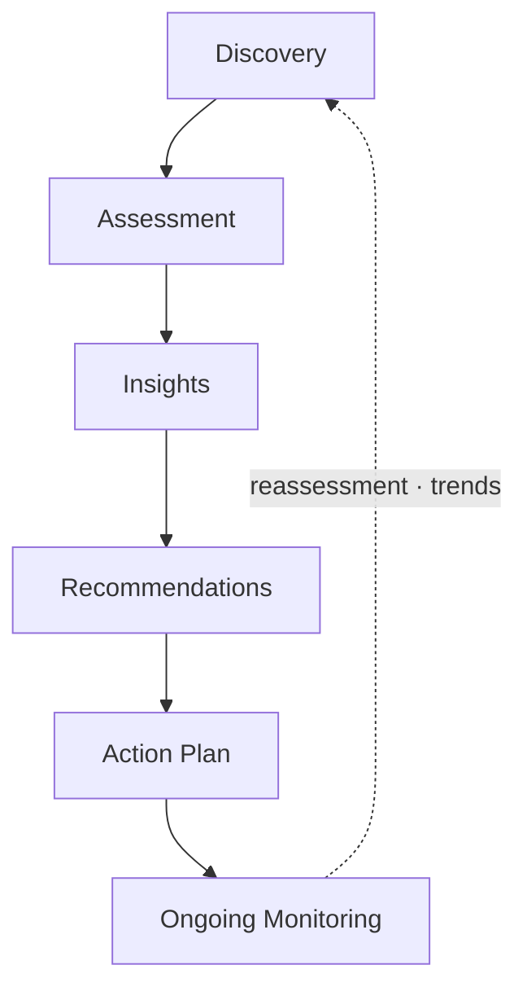

# AKILI Risk Intelligence — Product Deck

**Tagline:** The governance intelligence platform for modern family wealth.

**Entity:** AKILI Risk Intelligence · [akilirisk.com](https://akilirisk.com) · hello@akilirisk.com

> **Deck type:** Product explanation for advisors, enterprise buyers, demos, and diligence. For fundraising narrative, see [pitch-deck-investor.md](./pitch-deck-investor.md).

---

## Slide 1 — Title

**AKILI Risk Intelligence**

*Prevent family wealth from becoming family conflict.*

A governance intelligence platform for wealth advisors, family offices, and multi-generational households — built on a **10-pillar** family risk framework, live in production today.

---

## Slide 2 — Mission

**Legacy survives through governance, not assumption.**

AKILI helps modern family wealth operate with clearer governance — before informal structures become costly disputes.

We give families and advisors a structured way to surface risks, align decision frameworks, and act with intention.

---

## Slide 3 — The Problem We Solve

**Wealth is managed. Governance is assumed.**

- High-net-worth families hold complex assets, multiple generations, and informal decision structures — but rarely have a systematic view of non-financial risk.
- Advisors excel at portfolio construction yet lack a repeatable, evidence-based way to surface governance, cyber, succession, and continuity gaps.
- When structures fail, the cost is not measured in basis points — it is measured in disputes, reputational damage, and lost legacy.

Families and advisors need **one coherent risk profile** — not scattered conversations and anecdotal checklists.

---

## Slide 4 — What AKILI Delivers

**Family Risk Intelligence™** — a discreet digital profile that:

1. **Surfaces** structural gaps across 10 risk pillars
2. **Scores** household posture with transparent, weighted algorithms
3. **Prioritizes** missing controls and remediation actions
4. **Delivers** advisor-ready reports, policy templates, and recommendations
5. **Tracks** progress over time — living intelligence, not a one-time PDF

**Core value:** Turn informal family risk into measurable, actionable intelligence — before it becomes an event.

---

## Slide 5 — How It Works

| Stage | What happens |
|-------|----------------|
| **Discovery** | Branded invitation, secure onboarding, audio intake with AI transcription |
| **Assessment** | Advisor-scoped pillars (1–10), emphasis weighting, facilitated or self-service |
| **Insights** | Composite score, heat map, missing controls ranked by severity |
| **Recommendations** | Rule-based guidance mapped to professional services |
| **Action plan** | Policy templates, document collection, advisor-published deliverables |
| **Monitoring** | Dashboard trends, portfolio intelligence, annual reassessment cadence |

**Typical engagement:** 12–15 minutes per pillar; advisors scope each client to what matters.

---

## Slide 6 — Dual Experience

**Advisors**
- Multi-client pipeline with real-time status tracking
- Intake review, pillar scoping, and emphasis configuration
- Facilitated sessions and portfolio-wide intelligence
- Branded invitations, reports, and white-label subdomains (`{firm}.akilirisk.com`)
- Enterprise: team seats, firm billing, shared branding

**Families**
- Secure magic-link access and MFA
- Guided intake interview and scoped assessment
- Household profiles with roles and personalization
- Branded dashboard with scores, trends, and advisor emphasis visibility
- Document upload and policy delivery

**Distribution:** Advisor-led, invitation-only — clients enter through their advisor.

---

## Slide 7 — The 10-Pillar Framework *(current platform)*

**Shipped today.** Ten domains. One household profile.

| # | Pillar | What it measures |
|---|--------|------------------|
| 1 | **Governance & Decision-Making** | Authority, documentation, advisor coordination, dispute resolution |
| 2 | **Cyber & Digital Security** | Digital footprint, data protection, fraud, online threats |
| 3 | **Physical Security** | Personal safety, property, travel, access control |
| 4 | **Protection & Risk Transfer** | Insurance, titling, concentration, continuity planning |
| 5 | **Geographic & Environmental** | Climate, regional hazards, regulatory context |
| 6 | **Reputation & Social Risk** | Public footprint, conduct norms, crisis readiness |
| 7 | **Liquidity & Cash Management** | Reserves, credit headroom, illiquid concentration |
| 8 | **Tax Exposure** | Residency, deferral, AMT/surtax, estate-tax footprint |
| 9 | **Estate & Succession** | Wills, trusts, beneficiaries, digital asset access |
| 10 | **Behavioral Resilience** | Family dynamics, heir preparedness, behavioral finance |

Advisors **scope engagements** to the pillars that matter — full profile or focused assessment.

**Visual for slides:** 10-spoke radar or icon wheel (see investor deck for weighting reference).

---

## Slide 8 — Advisor Workflow

**From invitation to deliverable — one platform.**

| Stage | Capability |
|-------|------------|
| **Acquire** | Branded client invitations, white-label subdomains |
| **Onboard** | Secure registration, MFA, magic-link client access |
| **Discover** | Audio intake with transcription; advisor review & approval |
| **Customize** | Pillar scope, emphasis weighting, intake waivers |
| **Assess** | Facilitated or self-service; auto-save, smart resume |
| **Deliver** | PDF reports, per-pillar policy templates, document collection |
| **Manage** | Pipeline tracking, notifications, portfolio intelligence |

**Enterprise:** Multi-advisor firms, shared branding, firm-level billing, seat and client caps.

---

## Slide 9 — Intelligence & Deliverables

**What advisors and families see after assessment:**

- **Composite risk score** (0–10 scale, transparent breakdown across all 10 pillars)
- **Risk heat map** across the full framework with trend tracking
- **Missing controls** ranked by severity and impact
- **Automated recommendations** with service mappings and priority
- **Policy templates** pre-filled with household context (Word/PDF)
- **Branded PDF reports** suitable for client meetings

**Advisor intelligence layer:** Portfolio-wide insights, drill-down by client, risk signal monitoring.

**AI-assisted intake:** Audio interview + transcription captures context that used to live in notes and email.

---

## Slide 10 — Built for Trust

**Enterprise-grade security by design:**

| Control | Implementation |
|---------|----------------|
| Authentication | TOTP MFA, magic-link client access, role-based access |
| Encryption | AES-256-GCM at rest; secure document uploads via presigned S3 URLs |
| Isolation | Row-level data isolation; advisor–client relationship enforcement |
| Compliance posture | Consent workflows, audit logging, PII policy controls |
| Privacy | Private, encrypted responses visible only to assigned advisor |

Built on **Next.js**, **PostgreSQL**, **Prisma**, and **AWS** — designed for advisors managing 50+ family relationships.

---

## Slide 11 — Who We Serve

| Segment | Need |
|---------|------|
| **Wealth advisors & RIAs** | Differentiated governance offering alongside financial planning |
| **Multi-family offices** | Standardized risk assessment across the client book |
| **Family leadership** | Succession readiness and decision-framework clarity |
| **Enterprise advisory firms** | White-label platform, team seats, firm-wide client limits |

---

## Slide 12 — Business Model

**SaaS subscription — advisor pays, clients included.**

| Tier | Client limit | Target |
|------|--------------|--------|
| **Starter** | 25 clients | Solo advisors |
| **Growth** | 50 clients | Small practices |
| **Professional** | 100 clients | Established firms + custom branding |
| **Enterprise** | Negotiated (e.g. 100 firm clients, 25 seats) | Multi-advisor firms — sales-assisted |

- Monthly and annual billing (Stripe live in production)
- Hard client limits with in-app upgrade prompts
- Enterprise provisioned via sales (`sales@akilirisk.com`) — wire or Stripe

---

## Slide 13 — Product Status

**Live in production today:**

**Commercial traction:** **Belvedere** — first enterprise client on the white-label platform.

- **10-pillar personal risk framework** — full catalog in platform methodology and assessment flows
- **150+ assessment questions** spanning all 10 pillars
- Weighted scoring, missing-controls identification, pillar-level emphasis weighting
- Full lifecycle: household profiles, advisor portal, pipeline, invitations, document collection, billing, white-label
- **25+ mapped service recommendations** with cost/time estimates
- Per-pillar policy templates and branded PDF deliverables
- Enterprise architecture, team billing, and provisioning
- Playwright smoke coverage and Stripe billing integration

**In flight (depth, not breadth):**

- Unified composite scoring across all 10 pillars
- Cross-pillar AI insights and compounding-risk analysis
- Identity risk insights within Cyber & Digital Security
- Advisor-guided action plans tied to pillar-level outcomes

---

## Slide 14 — Platform Vision

Risk assessment is the first application. The platform grows into governance infrastructure:

- Living family governance records
- Advisor collaboration and family decision logs
- Annual risk reassessments and continuous monitoring
- Policy management and secure document collection
- Cross-generational continuity and AI-guided planning

---

## Slide 15 — Get Started

| Audience | Next step |
|----------|-----------|
| **Advisors** | [Request a demo](https://akilirisk.com/contact?intent=demo) |
| **Enterprise firms** | sales@akilirisk.com |
| **General inquiries** | hello@akilirisk.com |

---

## Appendix — Reference

### Sample client journey

1. Advisor sends branded invitation email
2. Client registers via secure link, sets up MFA
3. Client completes audio intake interview
4. Advisor reviews intake, selects risk pillars and emphasis areas
5. Client completes scoped assessment (auto-save throughout)
6. Platform scores responses, surfaces missing controls
7. Advisor publishes report; client views branded dashboard
8. Document collection, policy templates, ongoing monitoring

### Technical stack

Next.js · TypeScript · PostgreSQL · Prisma · Auth.js · OpenAI Whisper · AWS S3 · Resend · Stripe · @react-pdf/renderer · Vercel

### Speaker notes

**Slide 3:** Use for advisor audiences who already feel this pain — less story, more recognition.

**Slide 7:** Lead with "10 pillars, live today." Scoping is a feature — not every engagement needs all 10.

**Slide 9:** Demo the heat map and pipeline if possible — `preview.akilirisk.com` with seeded fixtures.

**Slide 12:** Confirm live price points from Stripe before external meetings.

---

*Product deck — for demos, advisor sales, and technical diligence.*
