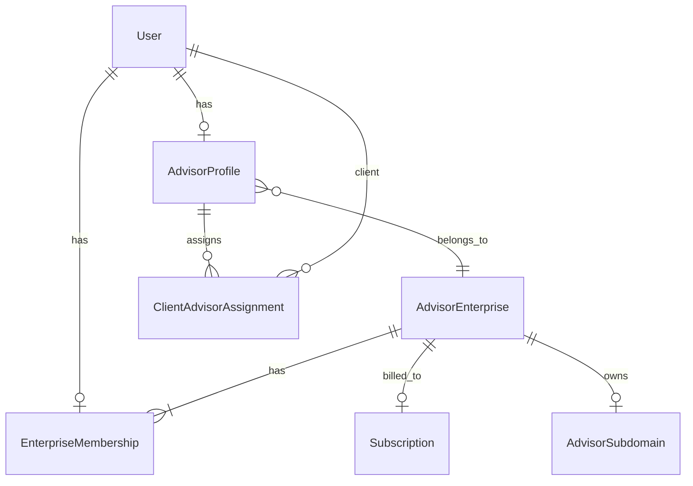

# Enterprise Advisor Plan — Specification

**Status:** Approved — ready for Phase 1 implementation  
**Author:** Product + engineering (2026-06-09)  
**Related:** `STRIPE-SPEC.md`, Epic 5.7 billing/branding, `src/lib/advisor/auth.ts`, `src/lib/billing/subscription-service.ts`

---

## Goal

Add an **Enterprise** advisor subscription tier that lets a single firm operate with **multiple advisor logins**, **firm-wide and per-advisor client caps**, **shared branding**, and **one firm-level subscription** provisioned through **sales only**—without breaking existing solo Starter / Growth / Professional advisors.

---

## Locked product decisions

| Topic | Decision |
|-------|----------|
| Client access | **Per-advisor assignments** — each advisor sees and works **their assigned clients** in pipeline/review (same as solo today). **OWNER / ADMIN** additionally get a **firm-wide portfolio view** for oversight. |
| Firm client cap | **100 clients** firm-wide (default starting point; admin-configurable at provisioning). Counts **distinct clients** with any ACTIVE assignment under the enterprise. |
| Per-advisor client cap | **25 clients** per advisor seat (default starting point; admin-configurable). Counts ACTIVE assignments on **that advisor’s** `AdvisorProfile`. Both caps enforced on invite. |
| Payment | **Sales-assisted only** — no self-serve Enterprise checkout. Primary method: **wire transfer** (offline invoicing). Secondary: **credit card** via Stripe (Customer Portal / invoice link) for firms that prefer card. |
| Upgrade path | **Sales only** — no in-app upgrade from Professional → Enterprise; firms contact sales / admin provisions. |
| Seat limit (default) | **25 advisor seats** per firm at provisioning (`seatLimit`); admin-configurable per contract. |
| Seat overage | **Report only in v1** — do not block invites or hub access when `activeSeats > seatLimit`; surface overage in admin and owner billing/team UI. |
| Solo → enterprise | User **must cancel their personal subscription first** before accepting an enterprise invite or being attached to a firm. No dual billing, no automatic migration. |
| Stripe portal | **Owner only** — `createPortalSession` and billing management UI restricted to `EnterpriseRole.OWNER`. ADMIN gets read-only usage summary. |
| Authentication | **Each advisor has their own login** (distinct `User` + `AdvisorProfile` per seat). |

---

## Assumptions

1. Solo advisors (Starter / Growth / Professional) continue to work unchanged with `Subscription.userId` and no enterprise row.
2. Enterprise firms are created by **platform admin** (or internal sales tooling), not self-serve signup.
3. Stripe subscription for Enterprise may be created in Stripe Dashboard or via admin action; webhooks sync status like today.
4. Default limits at provisioning: **`clientLimit = 100`**, **`perAdvisorClientLimit = 25`**, **`seatLimit = 25`**. All remain admin-configurable per contract; defaults are starting points for sales quotes, not hard-coded forever.
5. A client belongs to the firm once invited (counts toward the **100** firm cap) and is **assigned to the inviting advisor’s profile** (counts toward that advisor’s **25** cap). One ACTIVE assignment per client per firm.
6. MFA, soft-delete, and advisor portal kill-switch (`advisorPortalAccessEnabled`) continue to apply **per user**.
7. Wire-paid enterprises may have **no Stripe subscription id** initially; admin marks subscription ACTIVE after finance confirms payment (same pattern as admin-granted grace today).
8. A user with an active solo `Subscription` (`userId` set) **cannot** join an enterprise until that subscription is **cancelled** (or fully lapsed with no portal entitlement). Accept flow and admin attach must enforce this.

---

## Current state (baseline)

Today AkiliRisk is **1 login = 1 tenant**:

- `User` (role `ADVISOR`) → `AdvisorProfile` → clients via `ClientAdvisorAssignment.advisorId`
- `Subscription` is **1:1 with `User`** (`userId @unique`)
- Client limits count assignments for **one** `AdvisorProfile`
- Branding + subdomain live on `AdvisorProfile` / `AdvisorSubdomain`
- Hub gate: `getAdvisorHubAccessForUserId` checks **that user's** subscription

Existing tiers: `STARTER` (25), `GROWTH` (50), `PROFESSIONAL` (100) clients, 1 seat implicit.

---

## Target architecture

Introduce **`AdvisorEnterprise`** as the firm / billing tenant. Enterprise members keep individual `User` + `AdvisorProfile` rows so existing advisor code paths require minimal change.



### Billing context resolution

Every advisor session resolves entitlements through:

```
resolveBillingContext(userId):
  membership = EnterpriseMembership where userId AND status = ACTIVE
  if membership:
    return { kind: "enterprise", enterprise, subscription: enterprise.subscription }
  else:
    return { kind: "solo", subscription: user.subscription }
```

Portal access, client limits, and branding features use this context—not raw `User.subscription` alone.

---

## Data model

### New enum values

```prisma
enum SubscriptionTier {
  STARTER
  GROWTH
  PROFESSIONAL
  ENTERPRISE   // new
}

enum EnterpriseRole {
  OWNER
  ADMIN
  ADVISOR
}

enum EnterpriseMembershipStatus {
  INVITED
  ACTIVE
  SUSPENDED
}
```

### `AdvisorEnterprise`

| Field | Type | Notes |
|-------|------|-------|
| `id` | cuid | PK |
| `name` | string | Display name, e.g. “Acme Wealth Partners” |
| `slug` | string @unique | Subdomain label; same rules as `AdvisorSubdomain.subdomain` |
| `seatLimit` | int | Contracted advisor seats; **default 25**; overage reported, not enforced in v1 |
| `clientLimit` | int | Firm-wide client cap; **default 100** |
| `perAdvisorClientLimit` | int | Max ACTIVE clients per advisor profile; **default 25** |
| `billingContactUserId` | string? | FK → User; default owner |
| `paymentMethod` | enum? | `WIRE` \| `CARD` — ops label; wire = offline billing, card = Stripe-linked |
| Branding fields | mirror `AdvisorProfile` | Canonical firm branding (see Branding section) |
| `createdAt` / `updatedAt` | datetime | |

Relations: `memberships`, `subscription`, `advisorProfiles`, `subdomain` (optional 1:1).

### `EnterpriseMembership`

| Field | Type | Notes |
|-------|------|-------|
| `id` | cuid | PK |
| `enterpriseId` | string | FK |
| `userId` | string | FK → User |
| `advisorProfileId` | string | FK → AdvisorProfile (required when ACTIVE) |
| `role` | EnterpriseRole | OWNER / ADMIN / ADVISOR |
| `status` | EnterpriseMembershipStatus | |
| `invitedEmail` | string? | For INVITED rows before user exists |
| `invitedAt` / `acceptedAt` | datetime? | |
| `createdAt` / `updatedAt` | datetime | |

Constraints:

- `@@unique([enterpriseId, userId])`
- Exactly **one** `OWNER` per enterprise (enforce in app layer + partial unique index if feasible).
- Suspending a member sets `status = SUSPENDED`; hub access denied regardless of firm subscription.

### `Subscription` (evolve)

Add nullable `enterpriseId String? @unique`.

**Invariant:** exactly one of `userId` or `enterpriseId` is set.

| Path | `userId` | `enterpriseId` | `tier` |
|------|----------|----------------|--------|
| Solo advisor | set | null | STARTER / GROWTH / PROFESSIONAL |
| Enterprise firm | null | set | ESSENTIALS / PROFESSIONAL / BUSINESS / PLATINUM |

Keep existing columns (`clientLimit`, Stripe ids, branding flags, status, etc.). For enterprise rows, `clientLimit` mirrors `AdvisorEnterprise.clientLimit` (denormalized for existing read paths).

### `AdvisorProfile` (evolve)

Add `enterpriseId String?` FK → `AdvisorEnterprise`.

- Solo: `enterpriseId = null`
- Enterprise member: `enterpriseId` set; profile holds **personal** fields (`jobTitle`, `bio`, …) but **not** canonical firm branding

### `AdvisorSubdomain` (evolve — Phase 3)

Add `enterpriseId String? @unique` OR repoint `advisorId` to enterprise’s primary profile only.

**Preferred v1:** subdomain owned by `AdvisorEnterprise.slug`; `AdvisorSubdomain` links to enterprise (migration moves existing solo subdomains unchanged).

---

## Roles and permissions

| Capability | OWNER | ADMIN | ADVISOR |
|------------|:-----:|:-----:|:-------:|
| View own assigned clients (pipeline) | ✓ | ✓ | ✓ |
| View firm-wide client portfolio | ✓ | ✓ | — |
| Invite clients (subject to dual caps) | ✓ | ✓ | ✓ |
| Intake review / assessment / reports | ✓ | ✓ | ✓ |
| Edit firm branding | ✓ | ✓ | — |
| Manage team (invite, suspend, change roles) | ✓ | ✓* | — |
| View billing / usage (read-only) | ✓ | ✓ | — |
| Stripe Customer Portal / manage subscription | ✓ | — | — |
| Remove OWNER | — | — | — |

\* ADMIN cannot demote or remove the OWNER.

**Hub access:** ACTIVE membership + firm subscription qualifies (same rules as solo via `subscriptionQualifiesForPortalEnablement`) + user not deleted + `advisorPortalAccessEnabled` + MFA.

---

## Client limits and access (dual cap model)

### Default caps (v1 starting points)

| Limit | Default | Scope |
|-------|---------|--------|
| Firm client cap | **100** | Distinct clients with ACTIVE assignment to any profile in the enterprise |
| Per-advisor cap | **25** | ACTIVE assignments on one `AdvisorProfile` |

Constants (implementation):

```typescript
export const ENTERPRISE_DEFAULT_CLIENT_LIMIT = 100;
export const ENTERPRISE_DEFAULT_PER_ADVISOR_CLIENT_LIMIT = 25;
export const ENTERPRISE_DEFAULT_SEAT_LIMIT = 25;
```

Admin provisioning may override any default per contract.

### Limit enforcement on invite

Before creating a client invitation / assignment, when `resolveBillingContext` returns enterprise:

```typescript
countEnterpriseClients(enterpriseId): number
countActiveClientsForAdvisor(advisorProfileId): number  // existing helper

assertCanAddClientForEnterpriseInvite(enterpriseId, advisorProfileId):
  if countEnterpriseClients >= enterprise.clientLimit → ClientLimitError (firm cap)
  if countActiveClientsForAdvisor >= enterprise.perAdvisorClientLimit → ClientLimitError (advisor cap)
```

Both checks run; **either** cap blocks the invite. Error messages must distinguish firm vs advisor limit.

### Pipeline and detail queries

```typescript
getClientPipelineForAdvisor(userId):
  ctx = resolveBillingContext(userId)
  if ctx.kind === "enterprise" && ctx.role in (OWNER, ADMIN):
    return getClientPipelineForEnterprise(ctx.enterprise.id, options)  // all firm clients
  else if ctx.kind === "enterprise":
    return getClientPipeline(ctx.advisorProfileId, options)  // assigned only
  else:
    return getClientPipeline(advisorProfileId, options)  // solo — unchanged
```

Authorization:

- **ADVISOR** role: `getClientDetail` / review routes require ACTIVE assignment on **caller’s** profile (same as solo).
- **OWNER / ADMIN**: may open any client with an ACTIVE assignment under the firm.

### Assignment on invite

When an enterprise member invites a client:

- Create `ClientAdvisorAssignment` with `advisorId = inviter's AdvisorProfile.id`.
- Client counts toward **firm cap (100)** and **inviter’s per-advisor cap (25)**.

Re-inviting same client email within the firm: if an ACTIVE assignment already exists for that client under the same enterprise, **do not duplicate**; return existing assignment (idempotent). A second advisor cannot “claim” the same client without a future reassignment flow (out of scope v1).

---

## Billing and payment

### Enterprise provisioning (sales-only)

1. Sales closes custom quote (defaults: **25 seats**, 100 firm clients, 25 per advisor unless negotiated).
2. Admin creates `AdvisorEnterprise` + OWNER membership with `clientLimit`, `perAdvisorClientLimit`, `seatLimit`, and `paymentMethod`.
3. **Wire (primary):** Finance confirms payment offline → admin sets `Subscription` to `ACTIVE` with `tier = <module tier>`, `enterpriseId`, optional null `stripeSubscriptionId`. Record wire reference in admin notes / audit metadata.
4. **Card (secondary):** Admin creates Stripe Customer + Subscription (Dashboard or script) → webhooks sync via existing `upsertSubscriptionFromStripe` (extended for `enterpriseId` metadata). Owner may use Stripe Customer Portal for card updates and invoices.

**No** self-serve signup for enterprise **provisioning** in v1. Card firms may complete module-tier checkout after admin provision.

### Billing UI (`/advisor/billing`)

- Solo tiers: unchanged (Checkout + plan switch).
- Enterprise OWNER sees:
  - Plan: Enterprise (custom)
  - Firm client usage: `N / clientLimit` (default 100)
  - Per-advisor cap shown as policy: “Up to {perAdvisorClientLimit} clients per advisor” (default 25)
  - Seat usage: `activeSeats / seatLimit` with **overage badge** when `activeSeats > seatLimit`
  - Payment method label: Wire or Card
  - Stripe Customer Portal link **only when** `paymentMethod = CARD` and `stripeCustomerId` present
  - Copy: “Plan changes require contacting your account manager.”
- Enterprise ADMIN: read-only usage summary; **no** Stripe Customer Portal (owner only).
- Enterprise ADVISOR: no billing page (redirect or hidden nav).
- `createPortalSession` server action: reject unless caller is enterprise **OWNER** (solo advisors unchanged).

### Stripe metadata

Enterprise subscriptions should carry:

```json
{
  "enterpriseId": "<cuid>",
  "tier": "PROFESSIONAL",
  "billing_cycle": "MONTHLY|ANNUAL"
}
```

Webhook handler resolves row by `enterpriseId` when `userId` absent.

### Tier features

Enterprise members inherit the firm's **module tier** (`ESSENTIALS`–`PLATINUM`) from the enterprise `Subscription` row. Feature resolution uses `tierIncludesFeature` on that tier — not a separate `ENTERPRISE` subscription tier.

---

## Team management

### Invite flow

1. OWNER or ADMIN submits email + role (`ADMIN` | `ADVISOR`) on `/advisor/settings/team`.
2. System creates `EnterpriseMembership` with `status = INVITED`, sends email with secure accept link (reuse magic-link / invite patterns from client invitations where possible).
3. Accept path:
   - New user: sign up as `ADVISOR`, create `AdvisorProfile` with `enterpriseId`, activate membership.
   - Existing ADVISOR user without enterprise: attach profile to enterprise **only if** they have **no** active solo subscription (see Solo → enterprise below).
4. **v1 does not block** invite when `activeSeats + invited >= seatLimit`; record projected overage in audit + UI.

### Solo → enterprise migration

Users with a personal `Subscription` row (`userId` set, any solo tier) **must cancel first** before joining a firm:

1. **Invite accept:** If invitee has qualifying solo subscription → block with message: cancel personal plan in Billing, then retry accept link.
2. **Admin attach:** Same check; admin cannot add user to enterprise until solo sub is `CANCELLED` / lapsed (no `subscriptionQualifiesForPortalEnablement` on personal row).
3. **No automatic transfer** of solo clients, Stripe customer, or subscription to the enterprise — sales/admin handles firm setup separately.
4. After cancel + accept: user’s hub access comes **only** from enterprise membership + firm subscription.

### Suspension

OWNER/ADMIN sets member to `SUSPENDED` → immediate hub denial; client data unchanged.

### Reporting: seat overage

Define:

```typescript
activeSeats = count(memberships where status = ACTIVE)
seatOverage = max(0, activeSeats - seatLimit)
```

Expose in:

- Admin enterprise detail panel
- Owner billing / team page
- Optional CSV export field for ops

**Do not** block invites, logins, or hub access based on overage in v1.

---

## Branding and white-label

- **Canonical branding** stored on `AdvisorEnterprise` (logo, colors, brand name, PII policy default, etc.).
- Client-facing surfaces (dashboard, subdomain proxy, PDFs, invitation emails) resolve branding via enterprise when `AdvisorProfile.enterpriseId` is set.
- Solo advisors: unchanged (`AdvisorProfile` branding).
- Subdomain: `{enterprise.slug}[-staging].akilirisk.com` — one slug per firm.

Migration note: existing solo `AdvisorSubdomain` rows remain on `AdvisorProfile`; enterprise firms use enterprise-owned subdomain.

---

## UI surfaces

| Surface | Audience | Purpose |
|---------|----------|---------|
| `/advisor/settings/team` | OWNER, ADMIN | Member list, invite, suspend, role change, seat usage + overage indicator |
| `/advisor/billing` | OWNER (enterprise) | Firm usage meters, sales-only messaging, Stripe portal |
| `/advisor/billing` | Solo | Unchanged |
| `/admin/enterprises` (new) or extend `/admin/advisors` | ADMIN | Create firm, set limits, assign owner, link Stripe, view overage |
| Billing plan selector | Solo only | Enterprise card shows **“Contact sales”** CTA — no checkout button |
| Advisor nav | Enterprise members | “Team” link when OWNER/ADMIN |

---

## Implementation phases

### Phase 1 — Foundation (schema + billing context)

- Prisma models + migration
- `resolveBillingContext`, update `getAdvisorHubAccessForUserId`
- Enterprise client limit helpers
- Admin: create enterprise + owner (no team UI yet)
- Webhook + subscription upsert for `enterpriseId`

### Phase 2 — Dual limits + portfolio scoping

- Dual-cap invite enforcement (firm 100 + per-advisor 25 defaults)
- OWNER/ADMIN firm-wide pipeline; ADVISOR assigned-only pipeline
- Client detail / review authorization by role
- Idempotent assignment under same firm

### Phase 3 — Team + branding

- `/advisor/settings/team` + invite accept flow
- Enterprise branding resolution + subdomain on enterprise
- Seat / client usage reporting + overage display

### Phase 4 — Admin UX + polish

- Admin enterprise management screens
- Billing page enterprise owner view
- “Contact sales” on plan selector
- Documentation + runbook for sales provisioning

---

## Inputs / outputs

### Admin: create enterprise

**Input**

```typescript
{
  name: string
  slug: string
  ownerUserId: string          // existing User with ADVISOR role
  seatLimit?: number                // default 25
  clientLimit?: number              // default 100
  perAdvisorClientLimit?: number    // default 25
  paymentMethod: "WIRE" | "CARD"
  stripeSubscriptionId?: string     // required when paymentMethod = CARD
  stripeCustomerId?: string
}
```

**Output**

```typescript
{
  enterpriseId: string
  subscriptionId: string
  ownerMembershipId: string
}
```

### Team invite

**Input:** `{ email: string, role: "ADMIN" | "ADVISOR" }`  
**Output:** `{ membershipId: string, status: "INVITED" }`

### Billing context (internal)

**Output**

```typescript
type BillingContext =
  | { kind: "solo"; userId: string; advisorProfileId: string; subscription: Subscription | null }
  | { kind: "enterprise"; enterpriseId: string; role: EnterpriseRole; advisorProfileId: string; subscription: Subscription | null }
```

---

## Edge cases

| Case | Behavior |
|------|----------|
| User is ACTIVE in two enterprises | **Disallow** — `@@unique([userId])` on membership (one firm per user). |
| Solo subscribed user invited to enterprise | **Block accept/attach** until personal subscription is cancelled. No dual sub, no auto-migration. |
| OWNER deleted / deactivated | Admin must transfer ownership before delete, or assign new OWNER. |
| Firm subscription lapses | All members lose hub access (same as solo lapse). |
| Last OWNER suspended | Admin intervention required; prevent suspending last OWNER in app layer. |
| Client assigned under enterprise A, user mistakenly in enterprise B | Standard tenant isolation — B cannot see client. |
| Invite expired / revoked | Membership stays INVITED or deleted; link invalid. |
| `seatLimit = 0` or null | Treat as misconfiguration; admin UI validates `seatLimit >= 1`. |

---

## Out of scope (anti-goals)

- Self-serve Enterprise checkout or Professional → Enterprise upgrade in app
- Per-seat Stripe metering or automatic overage billing
- **Enforcing** seat limits (blocking invites or logins when over limit)
- Client reassignment between advisors within a firm (future; v1 = inviter owns assignment)
- Enterprise SSO / SCIM
- Cross-enterprise client sharing
- Auto-migrating all solo advisors into personal enterprises
- Dual solo + enterprise subscription on one user
- In-app solo → enterprise conversion without cancelling personal plan first
- Role granularity beyond OWNER / ADMIN / ADVISOR (e.g. read-only, compliance officer)
- Client choosing which advisor within firm sees them (still one firm portal)

---

## Acceptance criteria

### Phase 1

- [ ] AC-1: Admin can create an `AdvisorEnterprise` with owner, `seatLimit`, and `clientLimit`.
- [ ] AC-2: Enterprise has `Subscription` with module tier (`ESSENTIALS`–`PLATINUM`), `enterpriseId` set, `userId` null.
- [ ] AC-3: Owner with ACTIVE membership and qualifying subscription passes `getAdvisorHubAccessForUserId`.
- [ ] AC-4: Solo advisors without enterprise membership behave exactly as before (regression).
- [ ] AC-5: Stripe webhook updates enterprise subscription by `enterpriseId` metadata.

### Phase 2

- [ ] AC-6: Enterprise **ADVISOR** sees only their assigned clients in pipeline; **OWNER/ADMIN** sees all firm clients.
- [ ] AC-7: Client invite fails at firm cap (`clientLimit`, default 100) with distinct error message.
- [ ] AC-7b: Client invite fails at per-advisor cap (`perAdvisorClientLimit`, default 25) with distinct error message.
- [ ] AC-8: Member of enterprise A cannot open client detail for enterprise B (403 / not found).
- [ ] AC-9: Duplicate invite to same client within firm is idempotent (no second ACTIVE assignment).
- [ ] AC-9b: Enterprise ADVISOR cannot open a colleague’s client detail (only OWNER/ADMIN can).

### Phase 3

- [ ] AC-10: OWNER/ADMIN can invite by email; invitee gets own login on accept.
- [ ] AC-11: SUSPENDED member cannot access advisor hub.
- [ ] AC-12: Team page shows `activeSeats / seatLimit` and overage when `activeSeats > seatLimit`.
- [ ] AC-13: Client-facing branding uses enterprise branding for all firm members.
- [ ] AC-14: Subdomain resolves to enterprise tenant for verified enterprise slug.

### Phase 4

- [ ] AC-15: Billing plan selector shows Enterprise with “Contact sales” only (no checkout).
- [ ] AC-16: Enterprise OWNER billing page shows firm client usage, per-advisor cap policy, seat usage, payment method, and seat overage reporting.
- [ ] AC-17: Admin enterprise list shows seat overage column for ops reporting.
- [ ] AC-18: Wire-provisioned enterprise can be marked ACTIVE without Stripe subscription id; card-provisioned enterprise syncs via webhook.
- [ ] AC-19: User with active solo subscription cannot accept enterprise invite until personal sub is cancelled.
- [ ] AC-20: `createPortalSession` succeeds for enterprise OWNER only; ADMIN and ADVISOR receive unauthorized error.

---

## Test stubs

Skeleton names only — implement in Phase 1+ PRs. Bodies empty until feature work begins.

```typescript
// tests/enterprise/billing-context.test.ts
describe("resolveBillingContext", () => {
  it("returns solo context for advisor without membership");
  it("returns enterprise context for active member");
  it("returns solo when membership is SUSPENDED");
});

// tests/enterprise/hub-access.test.ts
describe("getAdvisorHubAccessForUserId — enterprise", () => {
  it("allows active member when enterprise subscription qualifies");
  it("denies member when enterprise subscription is UNPAID");
  it("does not require personal User.subscription for enterprise members");
});

// tests/enterprise/client-limit.test.ts
describe("enterprise client limits", () => {
  it("counts distinct clients across all profiles in firm");
  it("throws ClientLimitError at firm clientLimit (default 100)");
  it("throws ClientLimitError at perAdvisorClientLimit (default 25)");
  it("does not double-count client with one assignment toward firm cap");
  it("firm cap and advisor cap are both checked on invite");
});

// tests/enterprise/pipeline-scope.test.ts
describe("getClientPipelineForAdvisor — enterprise", () => {
  it("returns firm-wide pipeline for OWNER");
  it("returns firm-wide pipeline for ADMIN");
  it("returns assigned-only pipeline for ADVISOR role");
  it("excludes clients from other enterprises");
});

// tests/enterprise/authorization.test.ts
describe("enterprise client detail authorization", () => {
  it("allows OWNER to open client assigned to colleague");
  it("allows ADMIN to open client assigned to colleague");
  it("rejects ADVISOR opening colleague client");
  it("rejects advisor from different enterprise");
});

// tests/enterprise/team-invite.test.ts
describe("enterprise team invites", () => {
  it("creates INVITED membership and sends accept link");
  it("activates membership and links AdvisorProfile on accept");
  it("allows invite when activeSeats exceeds seatLimit (v1 report-only)");
  it("prevents second ACTIVE enterprise membership for same user");
  it("blocks accept when user has active solo subscription");
  it("allows accept after solo subscription cancelled");
});

// tests/enterprise/stripe-portal.test.ts
describe("enterprise Stripe portal access", () => {
  it("allows createPortalSession for OWNER");
  it("rejects createPortalSession for ADMIN");
  it("rejects createPortalSession for ADVISOR");
});

// tests/enterprise/seat-reporting.test.ts
describe("seat overage reporting", () => {
  it("computes seatOverage as max(0, activeSeats - seatLimit)");
  it("surfaces overage on team page without blocking access");
});

// tests/enterprise/branding.test.ts
describe("enterprise branding resolution", () => {
  it("uses AdvisorEnterprise branding for client dashboard");
  it("leaves solo advisor branding unchanged");
});

// tests/enterprise/subscription-webhook.test.ts
describe("Stripe webhook — enterprise", () => {
  it("upserts subscription by enterpriseId from metadata");
  it("never sets both userId and enterpriseId on one row");
});

// tests/smoke/enterprise-admin-provision.spec.ts  (Playwright)
describe("admin enterprise provisioning", () => {
  it("creates firm and owner can access advisor hub");
});

// tests/smoke/enterprise-pipeline-scope.spec.ts
describe("enterprise portfolio scoping", () => {
  it("advisor B does not see client invited by advisor A in pipeline");
  it("owner sees client invited by advisor A in firm-wide pipeline");
});
```

---

## Key files to touch (implementation reference)

| Area | Files |
|------|-------|
| Schema | `prisma/schema.prisma`, new migration |
| Billing context | `src/lib/enterprise/billing-context.ts` (new) |
| Auth gate | `src/lib/advisor/auth.ts` |
| Client limits | `src/lib/billing/subscription-service.ts` |
| Features | `src/lib/subscription/validation.ts` |
| Pipeline | `src/lib/pipeline/queries.ts` |
| Invites | `src/lib/actions/invitations.ts`, `src/lib/invitations/service.ts` |
| Webhooks | Stripe webhook handler + `src/lib/billing/subscription-service.ts` |
| Admin | `src/lib/admin/actions.ts`, new admin UI |
| Team UI | `src/app/(protected)/advisor/settings/team/page.tsx` (new) |
| Billing UI | `src/components/advisor/billing/BillingDashboard.tsx` |
| Subdomain | `src/lib/advisor/subdomain.ts`, `src/proxy.ts` |
| Docs | `STRIPE-SPEC.md` addendum when implementing |

---

## Review checklist

Before Phase 1 coding starts, confirm:

- [x] Firm cap **100**, per-advisor cap **25** as v1 defaults (stakeholder 2026-06-09)
- [x] Per-advisor pipeline for ADVISOR role; firm-wide for OWNER/ADMIN
- [x] Payment: wire primary, card secondary; sales-only provisioning
- [x] Solo → enterprise: **must cancel personal subscription first** (no dual sub)
- [x] Default `seatLimit` **25** for sales quotes (with client caps 100 / 25 per advisor)
- [x] Stripe Customer Portal: **owner only** (ADMIN read-only usage, no portal)

---

## Revision history

| Date | Change |
|------|--------|
| 2026-06-09 | Initial spec from planning session; locked product decisions per stakeholder |
| 2026-06-09 | Stakeholder thread: firm cap 100, per-advisor cap 25, wire/card payment, per-advisor access model |
| 2026-06-09 | Review closed: solo must cancel first; default seatLimit 25; Stripe portal owner-only. Spec approved. |
